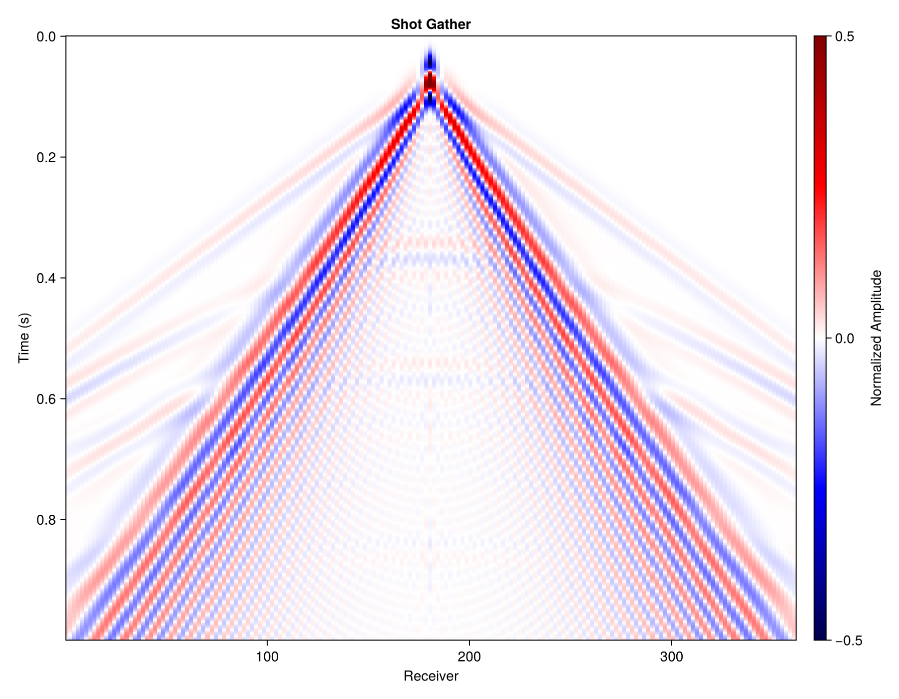

# ElasticWave2D.jl

## 🚨 项目已迁移

本项目代码已进行全面重构，并迁移至新的代码仓库。
请访问新仓库：**[Fomo.jl](https://github.com/Wuheng10086/Fomo.jl)**

**中文** | [🇺🇸 English](README.md)

<p align="center">
  <b>基于 Julia 的 GPU 加速二维弹性波模拟</b><br>
  <i>在你的笔记本上运行地震正演</i>
</p>

<p align="center">
  
</p>

## 为什么做这个？

**ElasticWave2D.jl** 是一个纯 Julia 的二维弹性波模拟工具：

- ✅ **一行安装** —— 纯 Julia，无需编译
- ✅ **支持 GPU** —— GTX 1060、RTX 3060 等消费级显卡
- ✅ **CPU 多线程** —— `julia -t auto` 自动并行
- ✅ **边界条件** —— HABC、镜像法、真空层

你可以在这里查看性能测试[docs/benchmark.md](docs/benchmark.md)

## 特性

| 特性 | 说明 |
|------|------|
| **GPU 加速** | 基于 CUDA.jl，比 CPU 快 10-50 倍 |
| **CPU 多线程** | `julia -t auto` 自动并行 |
| **交错网格有限差分** | 2-10 阶精度 (Virieux 1986) |
| **HABC 边界** | Higdon 吸收边界 (Ren & Liu 2014) |
| **镜像法** | 自由表面边界条件 (Robertsson 1996) |
| **真空层** | 支持地形起伏、隧道、空腔 (Zeng et al. 2012) |
| **视频录制** | 波场快照导出 MP4/GIF |
| **多种格式** | JLD2、二进制、SEG-Y（计划中） |

## 安装

```julia
using Pkg
Pkg.add(url="https://github.com/Wuheng10086/ElasticWave2D.jl")
```

**环境要求**：Julia 1.9+，GPU 可选（自动检测 CUDA）。

### 本地开发（clone 仓库后直接用）
在仓库根目录运行（关键是 `--project=.` 激活本地环境）：

```bash
julia --project=. -e 'import Pkg; Pkg.instantiate(); using ElasticWave2D; println(1)'
```

如果想在任意目录里直接 `using ElasticWave2D`，把本地路径注册到你的环境：

```julia
import Pkg
Pkg.develop(path="E:/dev/ElasticWave2D.jl")
```

### 运行模式与可选依赖
- CPU 模式：无 GPU 亦可运行，建议 `julia -t auto` 开启多线程。
- GPU 模式：安装 CUDA.jl 且设备可用（自动检测）。
- 可选数据格式依赖（按需安装）：`SegyIO`（SEG-Y）、`MAT`（.mat）、`NPZ`（.npy）。不在主依赖中，需要时自行：
  ```julia
  using Pkg
  Pkg.add(["SegyIO","MAT","NPZ"])  # 任选其一或多个
  ```
  读取示例（SEG-Y）：
  ```julia
  using SegyIO
  # segy = SegyIO.SegyFile("path.segy")
  ```

## 快速开始

```julia
using ElasticWave2D

# 创建一个简单的双层模型
nx, nz = 200, 100
dx = 10.0f0

vp = fill(2000.0f0, nz, nx)
vs = fill(1200.0f0, nz, nx)
rho = fill(2000.0f0, nz, nx)
vp[50:end, :] .= 3500.0f0  # 下层速度更快

model = VelocityModel(vp, vs, rho, dx, dx)

outputs = OutputConfig(base_dir="outputs/quickstart", plot_gather=true, video_config=nothing)
boundary = top_vacuum(10)  # 或 top_image(), top_absorbing()
simconf = SimConfig(nt=1000, cfl=0.4, fd_order=8, dt=nothing)

# 运行模拟
gather = simulate(
    model,
    SourceConfig(1000.0, 20.0; f0=20.0),           # 震源位于 (1000m, 20m深度)
    line_receivers(100.0, 1900.0, 181; z=10.0),    # 181 个检波器
    boundary,
    outputs,
    simconf
)

println("道集大小: ", size(gather))
# 运行后目录内会生成:
# - result.jld2
# - gather.png (plot_gather=true 时)
```

## 多炮批量模拟

使用 `BatchSimulator` 预分配资源，高效执行多炮采集：

```julia
using ElasticWave2D

# 模型设置（与单炮相同）
model = VelocityModel(vp, vs, rho, dx, dx)

# 创建批量模拟器（只分配一次 GPU/CPU 资源）
src_template = SourceConfig(0.0, 0.0; f0=20.0)  # 位置会被覆盖
receivers = line_receivers(100.0, 1900.0, 181; z=10.0)
boundary = top_image(nbc=50)
simconf = SimConfig(nt=2000)

sim = BatchSimulator(model, src_template, receivers, boundary, simconf)

# 定义炮点位置
src_x = Float32.(500:200:2500)  # 11 炮
src_z = fill(20.0f0, length(src_x))

# 执行所有炮（结果存内存）
gathers = simulate_shots!(sim, src_x, src_z)

# 或者使用输出配置和回调函数
outputs = OutputConfig(base_dir="outputs/batch", plot_gather=true, plot_setup=true)
simulate_shots!(sim, src_x, src_z; store=false, outputs=outputs) do gather, i
    @info "第 $i 炮完成" size=size(gather)
end
```

单炮复用已分配的模拟器：

```julia
gather1 = simulate_shot!(sim, 500.0f0, 20.0f0)
gather2 = simulate_shot!(sim, 600.0f0, 20.0f0; progress=true)
```

## 示例

### 🎬 弹性波演示
双层介质中的波传播，带视频输出。

```julia
using ElasticWave2D

model = VelocityModel(vp, vs, rho, 10.0f0, 10.0f0)

outputs = OutputConfig(
    base_dir="outputs/elastic_wave_demo",
    plot_gather=true,
    video_config=VideoConfig(fields=[:vz], skip=20, fps=30),
)

gather = simulate(
    model,
    SourceConfig(2000.0, 50.0, Ricker(15.0)),
    line_receivers(100, 3900, 191),
    top_image(),
    outputs,
    SimConfig(nt=3000)
)
```

<p align="center">
  
  
</p>

---

### 🏗️ 隧道探测
用地震绕射波探测地下空腔，真空层处理自由表面和隧道。

```julia
using ElasticWave2D

# 创建带隧道的模型（ρ=0, vp=0, vs=0 表示空腔）
nx, nz, dx = 200, 100, 5.0f0
vp = fill(2000.0f0, nz, nx)
vs = fill(1200.0f0, nz, nx)
rho = fill(2000.0f0, nz, nx)
rho[40:45, 95:105] .= 0.0f0  # 隧道空腔
vp[40:45, 95:105] .= 0.0f0
vs[40:45, 95:105] .= 0.0f0

model = VelocityModel(vp, vs, rho, dx, dx)

gather = simulate(
    model,
    SourceConfig(250.0, 10.0; f0=60.0),
    line_receivers(50.0, 950.0, 200; z=10.0),
    top_vacuum(10),
    OutputConfig(base_dir="outputs/tunnel_demo", plot_gather=true),
    SimConfig(nt=1500)
)
```

<p align="center">
  
  
</p>

**观察要点**：隧道边缘的绕射波，隧道后方的阴影区。

---

### 🛢️ 油气勘探
背斜构造成像，经典的油气圈闭。

<p align="center">
  
  
</p>

**观察要点**：背斜顶部的反射"上拉"，多层反射波。

---

### 🔬 边界条件对比

| 方法 | 面波 | 适用场景 |
|------|------|----------|
| `top_absorbing()` | ❌ | 仅体波研究 |
| `top_image()` | ✅ | 精确的平坦自由表面（镜像法） |
| `top_vacuum(n)` | ✅ | 地形起伏、空腔（推荐） |

```julia
# 对比不同边界条件
out = OutputConfig(base_dir="outputs/boundary_compare", plot_gather=false, video_config=nothing)
for boundary in [top_absorbing(), top_image(), top_vacuum(10)]
    simulate(model, source, receivers, boundary, out, SimConfig(nt=2000); progress=false)
end
```

<p align="center">
  
  
</p>
<p align="center">
  <i>左：镜像法 | 右：真空层公式</i>
</p>

## API 参考

### 核心类型

```julia
# 子波
Ricker(f0)                    # 主频 f0 的 Ricker 子波
Ricker(f0, delay)             # 带延迟
CustomWavelet(data)           # 自定义子波

# 震源
SourceConfig(x, z; f0=15.0)                    # 简单写法
SourceConfig(x, z, Ricker(15.0), ForceZ)       # 完整写法
# 震源类型: Explosion, ForceX, ForceZ, StressTxx, StressTzz, StressTxz

# 检波器
line_receivers(x0, x1, n; z=0.0)              # 一排检波器
ReceiverConfig(x_vec, z_vec)                   # 自定义位置
ReceiverConfig(x_vec, z_vec, Vx)              # 记录 Vx

# 边界
top_image()        # 镜像法（平自由表面）
top_absorbing()    # 顶边也用吸收
top_vacuum(n)      # 顶部 n 层真空（推荐）

# 配置
simconf = SimConfig(nt=3000, dt=nothing, cfl=0.4, fd_order=8)

# 视频
video_config = VideoConfig(fields=[:vz], skip=50, fps=20)
```

### 主要函数

```julia
# 单炮模拟（6 个位置参数）
gather = simulate(model, source, receivers, boundary, outputs, simconf)

# 批量模拟（高效多炮）
sim = BatchSimulator(model, src_template, receivers, boundary, simconf)
gather = simulate_shot!(sim, src_x, src_z)                    # 单炮
gathers = simulate_shots!(sim, src_x_vec, src_z_vec)          # 多炮
simulate_shots!(sim, src_x_vec, src_z_vec; store=false) do gather, i
    # 回调处理每炮结果
end
```

### 输出文件

使用 `OutputConfig(base_dir="outputs/shot1", plot_gather=true, video_config=video_config)` 时：

| 文件 | 说明 |
|------|------|
| `result.jld2` | 模拟结果（道集、震源、检波器） |
| `gather.png` | 道集图（`plot_gather=true` 时） |
| `setup.png` | 模型 + 震源 + 检波器图（`plot_setup=true` 时） |
| `wavefield_*.mp4` | 波场动画（`video_config!=nothing` 时） |

## 性能

**GPU**（RTX 3060, 12GB）：

| 网格 | 时间步 | 耗时 |
|------|--------|------|
| 400×200 | 3000 | ~8 秒 |
| 800×400 | 5000 | ~45 秒 |
| 1200×600 | 8000 | ~3 分钟 |

**CPU**（8核，`-t auto`）：约为 GPU 的 1/10 ~ 1/20 速度。

## 为什么做这个

作为地球物理专业学生，需要一个轻量的正演工具用于快速实验和学习。SOFI2D、SPECFEM 等软件功能完善，但配置相对复杂。

另外，HABC 边界条件相比 PML 计算效率更高，适合在普通硬件上运行。

基于以上需求开发了 ElasticWave2D.jl。

## 项目结构

```
ElasticWave2D.jl/
├── src/
│   ├── api/                # 单炮用户 API（simulate）
│   ├── domain/             # 用户层基础类型（wavelet/source/receiver）
│   ├── compute/            # CPU/GPU 抽象
│   ├── core/               # 基础类型
│   ├── physics/            # 计算核心
│   ├── initialization/     # 初始化
│   ├── solver/             # 时间步进、批量计算
│   ├── io/                 # 读写
│   ├── outputs/            # 输出路径与产物清单（扁平输出）
│   └── visualization/      # 画图、视频
├── examples/               # 示例
├── test/                   # 测试
└── docs/                   # 文档
```

## 参考文献

1. Virieux, J. (1986). P-SV wave propagation in heterogeneous media: Velocity-stress finite-difference method. *Geophysics*, 51(4), 889-901.

2. Zeng, C., Xia, J., Miller, R. D., & Tsoflias, G. P. (2012). An improved vacuum formulation for 2D finite-difference modeling of Rayleigh waves including surface topography and internal discontinuities. *Geophysics*, 77(1), T1-T9.

3. Ren, Z., & Liu, Y. (2014). A Higdon absorbing boundary condition. *Journal of Geophysics and Engineering*, 11(6), 065007.

## 引用

```bibtex
@software{elasticwave2d,
  author = {Wu Heng},
  title = {ElasticWave2D.jl: GPU-accelerated 2D Elastic Wave Simulation},
  url = {https://github.com/Wuheng10086/ElasticWave2D.jl},
  year = {2025}
}
```

## 贡献

欢迎提交 Issue 和 PR。

## 许可证

MIT License
